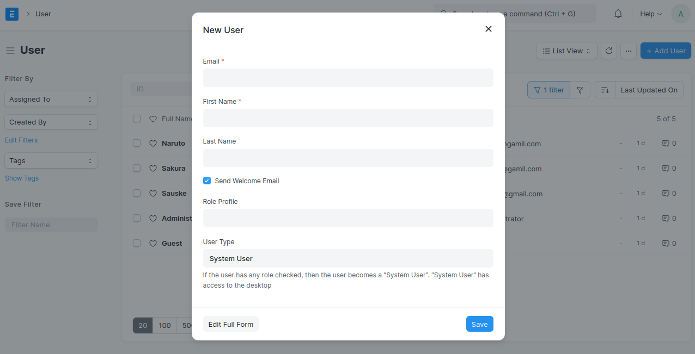
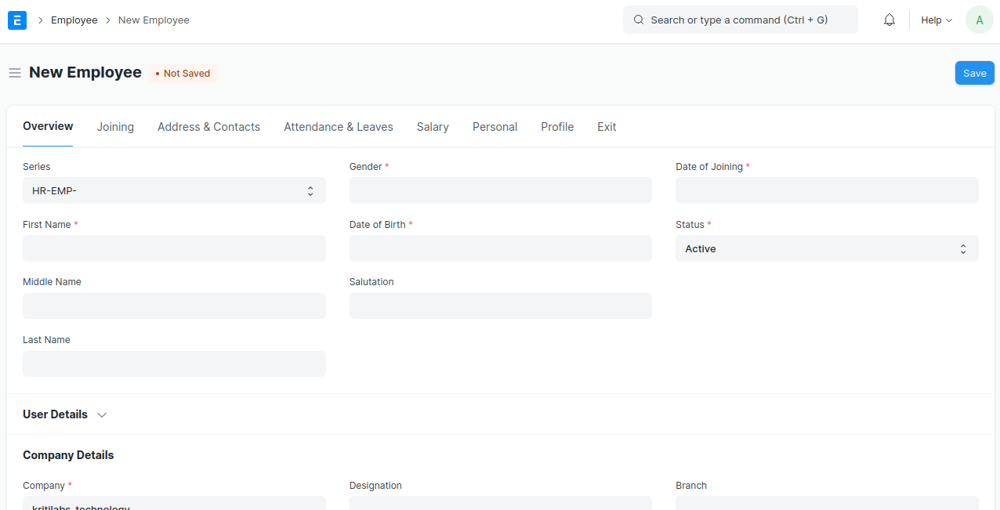
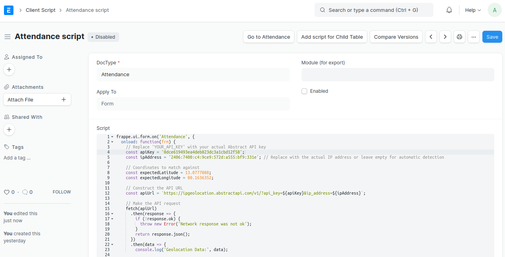
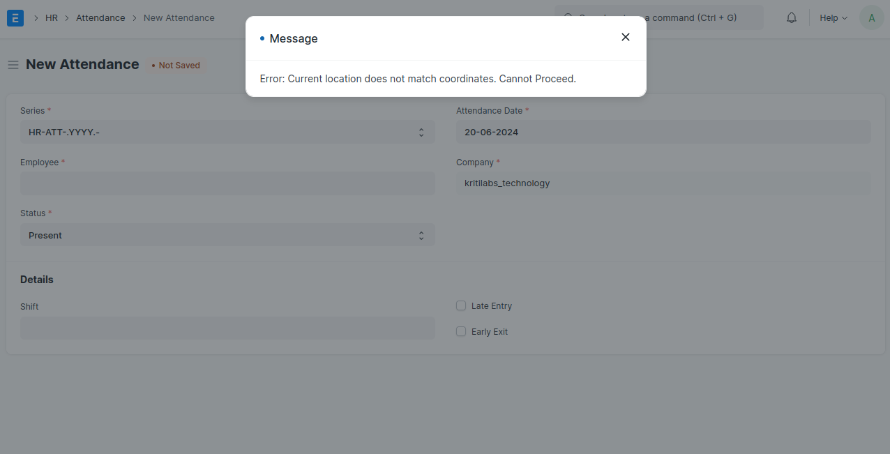
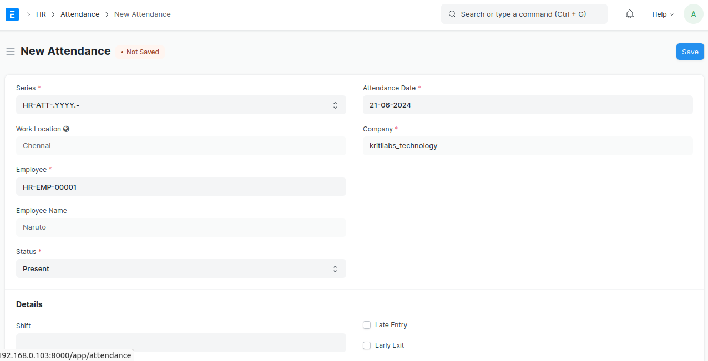

# ERPNext Geo-Location-Based Attendance System

This guide will help you set up an ERPNext system where employees can only mark attendance for their specific Geo-Locations using the ERPNext mobile application.

## Prerequisites

- ERPNext instance installed and running.
- Administrative access to the ERPNext instance.

## Steps

### 1. Create User

1. Go to **Home > Users and Permissions > User**.
2. Click on **New**.
3. Fill in the required fields (email, full name, etc.).
4. Assign roles (e.g., Employee, Attendance User).

**Screenshot:**


### 2. Create Employee

1. Go to **Home > Human Resources > Employee**.
2. Click on **New**.
3. Fill in the required fields (employee name, employee number, etc.).
4. Link the user created in step 1 in the **User ID** field.

**Screenshot:**



### 3. Mark Attendance with Work Geo-Location Validation

#### Add Custom Script

1. Go to **Home > Customization > Custom Script**.
2. Click on **New** to create a new script.
3. Fill in the details:
    - **Doctype:** Attendance
    - **Script Type:** Client
    - **Script:**



```javascript
frappe.ui.form.on('Attendance', {
  onload: function(frm) {
    const apiKey = '0dce619493ea4deb823dc3a1cbd12f58';
    const ipAddress = '2406:7400:c4:9ce9:572d:a555:bf9:331e'; // Replace with the actual IP address or leave empty for automatic detection

    // Coordinates to match
    const locations = [
      { name: 'Chennai', latitude: 13.8996, longitude: 80.2209 },
      { name: 'Bangalore', latitude: 12.8996, longitude: 80.2209},
      { name: 'Noida', latitude: 13.0358, longitude: 80.2444 }
    ];
    const tolerance = 0.01; // Tolerance for coordinate comparison

    const apiUrl = `https://ipgeolocation.abstractapi.com/v1/?api_key=${apiKey}${ipAddress ? `&ip_address=${ipAddress}` : ''}`;

    fetch(apiUrl)
      .then(response => {
        if (!response.ok) {
          throw new Error('Network response was not ok');
        }
        return response.json();
      })
      .then(data => {
        console.log('Geolocation Data:', data);

        const latitude = data.latitude;
        const longitude = data.longitude;

        console.log('Latitude:', latitude);
        console.log('Longitude:', longitude);

        let locationMatched = false;
        let matchedLocationName = '';

        for (const location of locations) {
          if (Math.abs(latitude - location.latitude) <= tolerance && Math.abs(longitude - location.longitude) <= tolerance) {
            locationMatched = true;
            matchedLocationName = location.name;
            break;
          }
        }

        if (locationMatched) {
          frm.set_value('custom_work_location', matchedLocationName);
          frm.save();
        } else {
          frappe.msgprint('Error: Current location does not match any of the predefined coordinates. Cannot Proceed.');
          frm.disable_save();
        }
      })
      .catch(error => {
        console.error('Error fetching geolocation:', error);
        frappe.msgprint('Error fetching geolocation. Please try again later.');
        frm.disable_save();
      });
  }
});

```
### 3. Setup Attendance

1. Go to **Home > Human Resources > Attendance**.
2. Click on **New**.
3. Fill in the required fields (employee, date, etc.).
4. If you get the error as below it means you are at invalid location.
5. If your in the correct work location, the work location field will pick the location name by default.

**Screenshot:**




#### License

MIT